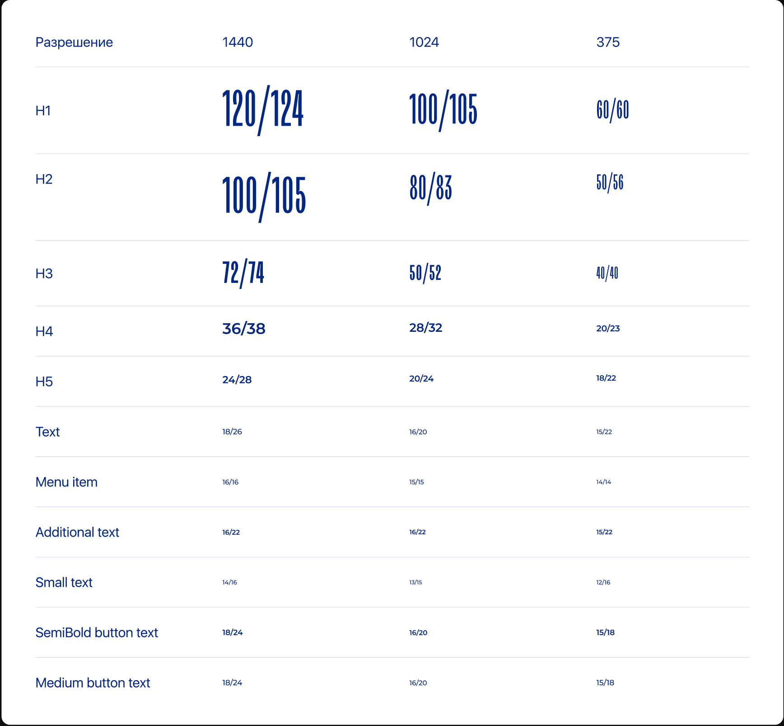
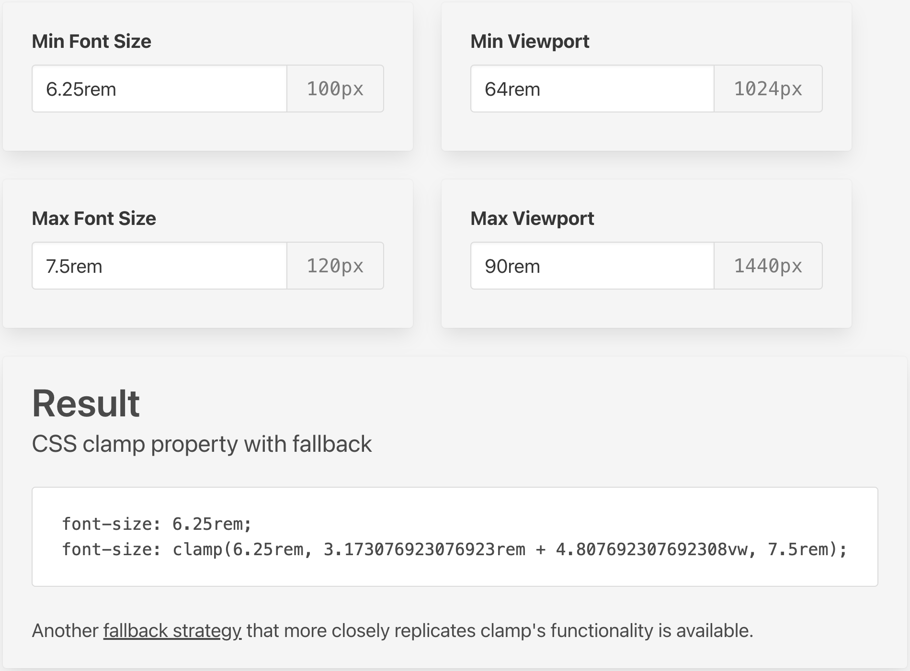

# 🎨 Типографическая система

> **Из чего состоит, как использовать и как согласовать с дизайном**

---

## 📋 Содержание

- [🔧 Принцип работы типографической системы. Зачем нужны rem?](#typo-1)
- [🎯 Что необходимо получить от дизайна для успешной реализации системы?](#typo-2)
- [⚙️ Как это работает? Пошаговая реализация](#typo-3)
- [💻 Пример реализации. Полный код](#typo-4)

---

## 🔧 <a id="typo-1"/>Принцип работы типографической системы. Зачем нужны rem?

> **💡 Основная концепция**

Типографическая система является одной из основных частей общего подхода к реализации резинового адаптива сайта. Она создает рамки и
фиксированные переменные, по которым должен следовать каждый текстовый блок сайта, благодаря чему текст на брейкпойнтах идеально совпадает с
макетом, а на экранах между ними увеличивается пропорционально экрану пользователя. На экранах больше самого последнего брейкпойнта (например,
1440 или 1920) шрифт увеличивается с фиксированным коэффициентом, который мы будем задавать сами.

Система построена на основе rem, который мы берем из font-size у <html> (никак не меняем это значение сами!). Такой подход обуславливается принципами доступности в браузере, наш шрифт зависит от настроек пользователя в браузере. Для простейшей проверки, можно добавить на страницу span, с font-size: 1rem; затем необходимо поменять в настройках браузера размер шрифта (по дефолту выбран "Средний"). В зависимости от выбранного
размера шрифта будет меняться размер нашего текстового блока, так как эта настройка перезаписывает стиль font-size у <html> (от которого и идет
значение rem).

### 🎯 Ключевые особенности:

- ✅ **Идеальное соответствие макету** на всех брейкпойнтах
- ✅ **Пропорциональное масштабирование** между брейкпойнтами
- ✅ **Фиксированный коэффициент увеличения** на больших экранах
- ✅ **Зависимость от настроек браузера** пользователя

---

## 🎯 <a id="typo-2"/>Что необходимо получить от дизайна для успешной реализации системы?

> **📋 Требования к дизайну**

Со стороны дизайна, практически во всех случаях, вы получите значения переменных в px. Помимо этого, здесь же мы обьявляем переменные для line-height. Говоря об lh, нет необходимости менять его резиново, так как это коэффициент, и на данный момент мне еще не встречались ситуации, в которых line-height также нужно менять резиново как и сам шрифт, чаще всего мы меняем его простыми медиа-запросами по брейкпоинтам.

### 📊 Пример соответствия:

| Элемент | 1440px | 1024px | 375px |
| ------- | ------ | ------ | ----- |
| **H1**  | 120px  | 100px  | 60px  |

> **🎯 Главное требование:** Каждый заголовок на всех экранах должен полностью совпадать с таблицей шрифтов.

### 📋 Что нужно получить от дизайна:

- ✅ **Таблица с переменными** (обязательно!)
- ✅ **Значения для всех брейкпойнтов**
- ✅ **Line-height для каждого элемента**
- ✅ **Согласованность в использовании**

### 📊 Пример таблицы с переменными

В таблице в значении через / указан line-height соответствующего шрифта, который впоследствии переводится в коэффициент



---

## ⚙️ <a id="typo-3"/>Как это работает?

> **📝 Пошаговое руководство на основе таблицы выше**

### 🔢 Шаг 1: Перевод px в rem

Со стороны дизайна вы получите значения в px. Для начала нужно перевести эти значения в rem, разделив полученные значения на 16 (дефолтное значение rem при размере шрифта в браузере "Средний") и обьявить переменные в :root.:

```css
:root {
  --h1: 7.5rem; /* 120px ÷ 16 */
  --h2: 6.25rem; /* 100px ÷ 16 */
  --h3: 4.5rem; /* 72px ÷ 16 */
  --h4: 2.25rem; /* 36px ÷ 16 */
  --h5: 1.5rem; /* 24px ÷ 16 */
  --text: 1.125rem; /* 18px ÷ 16 */
  --button-text: 1.125rem;
  --menu-item: 1rem;
  --additional-text: 1rem;
  --small-text: 0.875rem; /* 14px ÷ 16 */

  /* Line-height переменные */
  --h1-lh: 1.03;
  --h2-lh: 1.05;
  --h3-lh: 1.03;
  --h4-lh: 1.05;
  --h5-lh: 1.17;
  --text-lh: 1.44;
  --button-text-lh: 1.33;
  --menu-item-lh: 1;
  --additional-text-lh: 1.375;
  --small-text-lh: 1.14;
}
```

### 🧮 Шаг 2: Использование калькулятора clamp

Переходим на [**Fluid Typography Calculator**](https://royalfig.github.io/fluid-typography-calculator/) для получения clamp значений.

#### 📊 Настройки для H1:

- **Min Font Size:** 6.25rem (100px) - размер шрифта H1 на 1024px
- **Max Font Size:** 7.5rem (120px) - размер шрифта H1 на 1440px
- **Min Viewport:** 64rem (1024px) - минимальный экран
- **Max Viewport:** 90rem (1440px) - максимальный экран



### 📱 Шаг 3: Медиа-запросы

Получившиеся значения записываем в медиа запрос на 1440px

```css
@media (min-width: 1024px) and (max-width: 1440px) {
  --h1: clamp(6.25rem, 3.173076923076923rem + 4.807692307692308vw, 7.5rem);
}
```

Это действие повторяем для всех переменных. Далее в этом же медиа-запросе указываем значения line-height для этого брейкпоинта

```css
--h1-lh: 1.05;
--h2-lh: 1.0375;
--h3-lh: 1.04;
--h4-lh: 1.14;
--h5-lh: 1.2;
--text-lh: 1.25;
--button-text-lh: 1.25;
--menu-item-lh: 1;
--additional-text-lh: 1.375;
--small-text-lh: 1.15;
```

Для изменения между 1024 и 375 делаем такое же действие с калькулятором для каждой переменной и для переменных line-height, но в медиа запросе не указываем минимальное значение экрана:

```css
@media (max-width: 1023px) {
  --h1: clamp(3.75rem, 2.303240740740741rem + 6.172839506172839vw, 6.25rem);
  /* Повторить для всех переменных */
}
```

### 🖥️ Шаг 4: Большие экраны (1441px+)

Вычисляем коэффициент увеличения:

Следующим шагом напишем медиа-запрос для изменения шрифта на экранах выше нашего самого высокого брейкпоинта (1440). Для этого нам понадобится вычислить изменение font-size на каждый пиксель ширины экрана. Для этого мы берем для каждой переменной изменение font-size с последнего и предпоследнего брейкопинта (например, для H1, где на 1024 оно равно 6.25rem, на 1440 равно 7.5rem):
`7.5rem - 6.25rem = 1.25rem`
Далее берем изменение ширины экрана:
`90rem (1440px) - 64rem (1024px) = 26rem`
Вычисляем изменение шрифта:
`1.25rem / 26rem = 0.048rem`

Далее создаем медиа-запрос на min-width: 1441px:

```css
@media screen and (min-width: 1441px) {
  --h1: calc(7.5rem + (0.048 * (100vw - 90rem)));
}
```

Где 7.5rem - максимальное значение на 1440, 0.048 - полученный коэффициент, 100vw - 90rem - насколько экран пользователя больше максимального значения брейкпоинта. Иногда для мелкого текста можно добавить коэффициент, например 1.25 или 1.5625 для более видимого увеличения шрифта.

### 🎨 Шаг 5: Создание миксинов

Отлично! Главная часть нашей системы выполнена. Теперь необходимо записать эти значения в @mixin для каждого типа шрифта, например:

```css
@define-mixin font-h1 {
  font-size: var(--h1);
  line-height: var(--h1-lh);
}
```

Теперь все готово к использованию. Внутри селектора блока текста используйте миксин

```css
@mixin font-h1;
```

и все будет работать.

---

---

## 💻 <a id="typo-4"/>Пример реализации. Полный код

```css
:root {
  --h1: 7.5rem;
  --h2: 6.25rem;
  --h3: 4.5rem;
  --h4: 2.25rem;
  --h5: 1.5rem;
  --text: 1.125rem;
  --button-text: 1.125rem;
  --menu-item: 1rem;
  --additional-text: 1rem;
  --small-text: 0.875rem;

  --h1-lh: 1.03;
  --h2-lh: 1.05;
  --h3-lh: 1.03;
  --h4-lh: 1.05;
  --h5-lh: 1.17;
  --text-lh: 1.44;
  --button-text-lh: 1.33;
  --menu-item-lh: 1;
  --additional-text-lh: 1.375;
  --small-text-lh: 1.14;

  @media (min-width: 1024px) and (max-width: 1440px) {
    --h1: clamp(6.25rem, 3.173076923076923rem + 4.807692307692308vw, 7.5rem);
    --h2: clamp(5rem, 1.923076923076923rem + 4.807692307692308vw, 6.25rem);
    --h3: clamp(3.125rem, -0.259615384615385rem + 5.288461538461539vw, 4.5rem);
    --h4: clamp(1.75rem, 0.5192307692307692rem + 1.9230769230769231vw, 2.25rem);
    --h5: clamp(1.25rem, 0.6346153846153846rem + 0.9615384615384616vw, 1.5rem);
    --text: clamp(1rem, 0.6923076923076923rem + 0.4807692307692308vw, 1.125rem);
    --button-text: clamp(
      1rem,
      0.6923076923076923rem + 0.4807692307692308vw,
      1.125rem
    );
    --menu-item: clamp(
      0.94rem,
      0.7923076923076922rem + 0.230769230769231vw,
      1rem
    );
    --additional-text: 1rem;
    --small-text: clamp(
      0.813rem,
      0.6603846153846151rem + 0.2384615384615387vw,
      0.875rem
    );

    --h1-lh: 1.05;
    --h2-lh: 1.0375;
    --h3-lh: 1.04;
    --h4-lh: 1.14;
    --h5-lh: 1.2;
    --text-lh: 1.25;
    --button-text-lh: 1.25;
    --menu-item-lh: 1;
    --additional-text-lh: 1.375;
    --small-text-lh: 1.15;
  }

  @media (max-width: 1023px) {
    --h1: clamp(3.75rem, 2.303240740740741rem + 6.172839506172839vw, 6.25rem);
    --h2: clamp(3.125rem, 2.0399305555555554rem + 4.62962962962963vw, 5rem);
    --h3: clamp(2.5rem, 2.138310185185185rem + 1.5432098765432098vw, 3.125rem);
    --h4: clamp(1.25rem, 0.9606481481481481rem + 1.2345679012345678vw, 1.75rem);
    --h5: clamp(
      1.125rem,
      1.052662037037037rem + 0.30864197530864196vw,
      1.25rem
    );
    --text: clamp(0.94rem, 0.9052777777777777rem + 0.14814814814814828vw, 1rem);
    --button-text: clamp(
      0.94rem,
      0.9052777777777777rem + 0.14814814814814828vw,
      1rem
    );
    --menu-item: clamp(
      0.875rem,
      0.8373842592592593rem + 0.16049382716049368vw,
      0.94rem
    );
    --additional-text: clamp(
      0.94rem,
      0.9052777777777777rem + 0.14814814814814828vw,
      1rem
    );
    --small-text: clamp(
      0.75rem,
      0.7135416666666667rem + 0.15555555555555542vw,
      0.813rem
    );

    --h1-lh: 1;
    --h2-lh: 1.12;
    --h3-lh: 1;
    --h4-lh: 1.15;
    --h5-lh: 1.22;
    --text-lh: 1.47;
    --button-text-lh: 1.12;
    --menu-item-lh: 1;
    --additional-text-lh: 1.47;
    --small-text-lh: 1.33;
  }

  @media screen and (min-width: 1441px) {
    --h1: calc(7.5rem + (0.048 * (100vw - 90rem)));
    --h2: calc(6.25rem + (0.048 * (100vw - 90rem)));
    --h3: calc(4.5rem + (0.0528 * (100vw - 90rem)));
    --h4: calc(2.25rem + (0.0192 * (100vw - 90rem)));
    --h5: calc(1.5rem + (0.0096 * (100vw - 90rem) * 1.25));
    --text: calc(1.125rem + (0.0048 * (100vw - 90rem) * 1.5625));
    --menu-item: calc(1rem + (0.0048 * (100vw - 90rem) * 1.5625));
    --additional-text: calc(1rem + (0.0048 * (100vw - 90rem) * 1.5625));
    --button-text: calc(1.125rem + (0.0048 * (100vw - 90rem) * 1.5625));
    --small-text: calc(0.875rem + (0.0048 * (100vw - 90rem) * 1.5625));
  }
}

@define-mixin font-h1 {
  font-size: var(--h1);
  line-height: var(--h1-lh);
  text-transform: uppercase;
  font-family: "TT Trailers";
  font-weight: 500;
}

@define-mixin font-h2 {
  font-size: var(--h2);
  line-height: var(--h2-lh);
  text-transform: uppercase;
  font-family: "TT Trailers";
  font-weight: 500;
}

@define-mixin font-h3 {
  font-size: var(--h3);
  line-height: var(--h3-lh);
  font-family: "TT Trailers";
}

@define-mixin font-h4 {
  font-size: var(--h4);
  line-height: var(--h4-lh);
}

@define-mixin font-h5 {
  font-size: var(--h5);
  line-height: var(--h5-lh);
}

@define-mixin font-text {
  font-size: var(--text);
  line-height: var(--text-lh);
}

@define-mixin font-button-text {
  font-size: var(--button-text);
  line-height: var(--button-text-lh);
}

@define-mixin font-menu-item {
  font-size: var(--menu-item);
  line-height: var(--menu-item-lh);
}

@define-mixin font-additional-text {
  font-size: var(--additional-text);
  line-height: var(--additional-text-lh);
}

@define-mixin font-small-text {
  font-size: var(--small-text);
  line-height: var(--small-text-lh);
}
```
